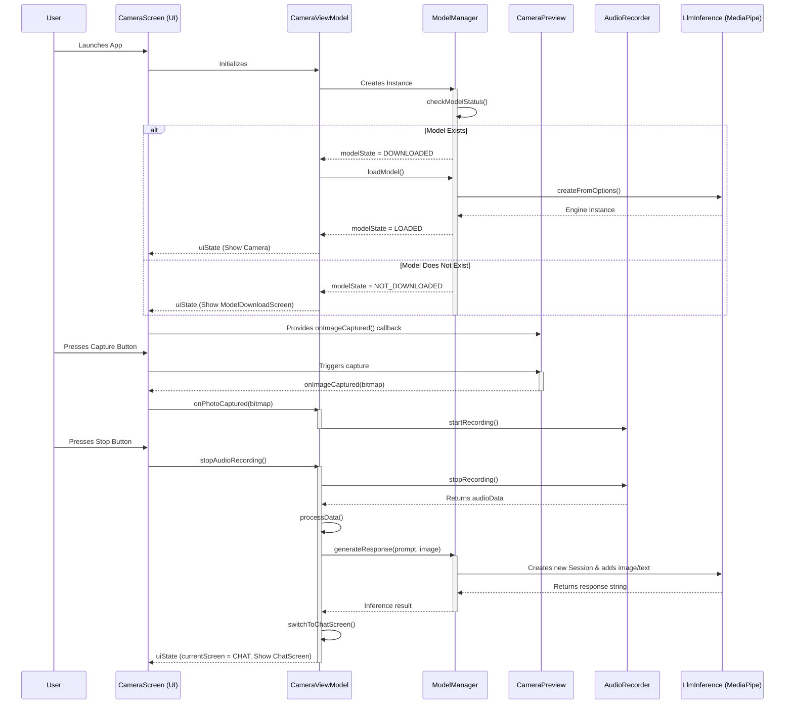
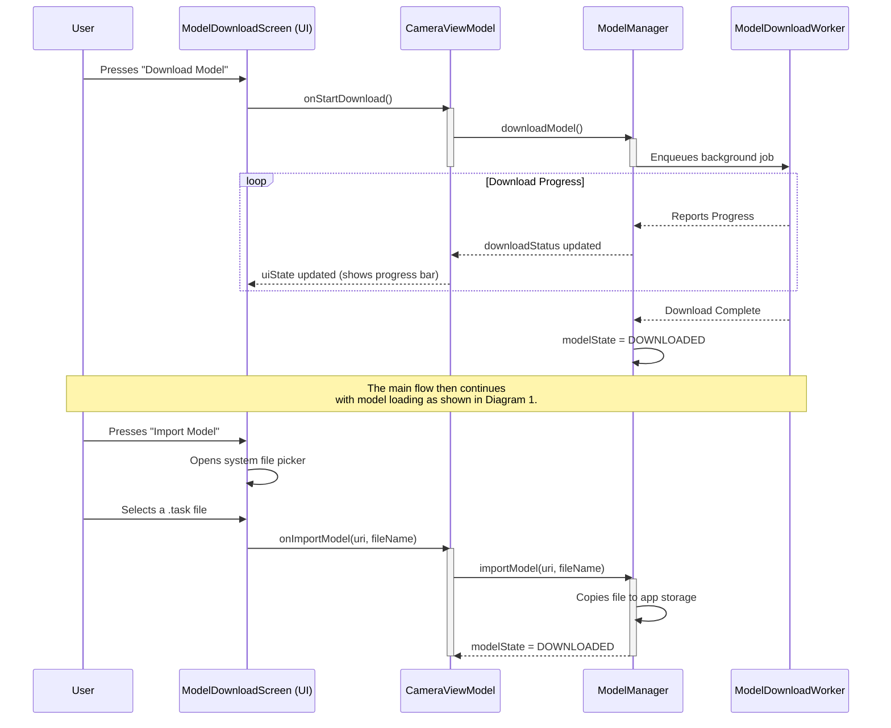

# Project Documentation: Cursor Agent Android App

---
<div style="text-align: center;">
  
  
</div>

---

# Architectural details

The SaveMe solution consists of an Android application for in-field use and a companion website for knowledge management.

### 2.1. Android Application

The SaveMe application is built as a native Android application using Kotlin and Jetpack Compose. The architecture is designed to be modular and scalable, with a clear separation of concerns between the UI, the application logic, and the AI models.

The application is composed of the following key components:

*   **UI Layer (`MainActivity.kt`, `CameraScreen.kt`, `CameraViewModel.kt`):** This layer is responsible for rendering the user interface and handling user input. It's built with Jetpack Compose, which allows for a declarative and modern UI. The `CameraViewModel` acts as a bridge between the UI and the underlying application logic.
*   **Application Logic (`CameraViewModel.kt`):** This is the heart of the application, orchestrating the interaction between the UI, the AI models, and the various services. It manages the application's state and handles the entire workflow, from capturing images and audio to processing them with the AI models and presenting the results to the user.
*   **AI Model Management (`ModelManager.kt`):** This component is responsible for managing the Gemma 3n model. It handles the downloading, validation, loading, and execution of the model. It uses the MediaPipe GenAI library to interact with the model and provides a clean, high-level API for the rest of the application.
*   **Speech-to-Text (`TranscriptionService.kt`):** This service is responsible for converting the user's speech into text. It uses a local Whisper model for on-device transcription, ensuring privacy and offline availability.
*   **Text-to-Speech (`TTSManager.kt`):** This service converts the AI's text response into speech. It uses Android's built-in TTS engine and implements a custom streaming solution to provide a real-time, natural-sounding voice.
*   **Supporting Components:** The application also includes several supporting components, such as `AudioRecorder` for handling audio input, `FileManager` for local data storage, and `AudioConverter` for audio format conversion.

The following diagram illustrates the high-level architecture of the application:

```
[User] -> [UI Layer (Jetpack Compose)] <-> [CameraViewModel] <-> [ModelManager (Gemma 3n)]
                                             ^
                                             |
                                             v
                               [TranscriptionService (Whisper)]
                                             ^
                                             |
                                             v
                                     [TTSManager (Android TTS)]
```

This architecture ensures that each component has a single responsibility, making the application easier to understand, maintain, and extend. The use of on-device AI models for both speech-to-text and the core LLM ensures that the application is fast, responsive, and can function without a persistent internet connection.

### 2.2. Website

A companion website allows companies to manage the knowledge bases for their "Digital Twins." This is where user manuals, safety regulations, and other critical documents are processed and made available for download by the Android application.

## 3. Gemma 3n Implementation

The core of the SaveMe application is its use of the Gemma 3n model to provide intelligent, context-aware assistance. The implementation is handled by the `ModelManager` class, which encapsulates all the logic for interacting with the model. More specifically the gemma-3n-E2B-it-int4 model in .task format.

### 3.1. Model Loading and Configuration

The application uses the MediaPipe GenAI library to load and run the Gemma 3n model. The `loadModel` function in `ModelManager.kt` is responsible for this process. Here's a simplified version of the code:

```kotlin
// In ModelManager.kt

fun loadModel(): Boolean {
    // ...
    val options = LlmInference.LlmInferenceOptions.builder()
        .setModelPath(modelFile.absolutePath)
        .setMaxTokens(4096)
        .setMaxTopK(40)
        .setMaxNumImages(if (ModelConfig.SUPPORTS_VISION) 1 else 0)
        .build()

    val llmInference = LlmInference.createFromOptions(context, options)

    val session = LlmInferenceSession.createFromOptions(
        llmInference,
        LlmInferenceSession.LlmInferenceSessionOptions.builder()
            .setTopK(10)
            .setTopP(0.3f)
            .setTemperature(0.2f)
            .setGraphOptions(
                GraphOptions.builder()
                    .setEnableVisionModality(ModelConfig.SUPPORTS_VISION)
                    .build()
            )
            .build()
    )
    // ...
}
```

This code snippet demonstrates several key aspects of the implementation:

*   **Dynamic Vision Support:** The application dynamically enables vision support based on the loaded model. The `ModelConfig.SUPPORTS_VISION` flag, which is set by inspecting the model's filename, allows the app to seamlessly switch between vision-enabled and text-only models. The current setup of the app works only with multimodal models with vision support. 
*   **Model Configuration:** The `LlmInferenceOptions` are used to configure the model, setting parameters like the maximum number of tokens and the number of images that can be processed.
*   **Session Configuration:** The `LlmInferenceSessionOptions` are used to control the model's output. The `topK`, `topP`, and `temperature` parameters are tuned to produce more deterministic and coherent responses.

### 3.2. Multimodal Input and Streaming Response

The `generateResponseStreaming` function is where the magic happens. It takes a text prompt and an image, and it returns a streaming response from the model. Here's a simplified overview of the process:

```kotlin
// In ModelManager.kt

fun generateResponseStreaming(
    prompt: String,
    imageBitmap: Bitmap? = null,
    onTokenReceived: (token: String, isComplete: Boolean) -> Unit
) {
    // 1. Reset the session to clear previous context
    resetSession()

    // 2. Add the "Digital Twin" context to the prompt
    val fullPrompt = getFullPromptWithContext(prompt)

    // 3. Add the image to the session if vision is supported
    if (ModelConfig.SUPPORTS_VISION && imageBitmap != null) {
        session.addImage(BitmapImageBuilder(imageBitmap).build())
    }

    // 4. Add the prompt to the session
    session.addQueryChunk(fullPrompt)

    // 5. Generate a streaming response
    session.generateResponseAsync { partialResult, done ->
        onTokenReceived(partialResult, done)
    }
}
```

This implementation highlights several advanced features:

*   **Session Management:** The `resetSession()` call is crucial for ensuring that each interaction with the model is independent and not influenced by previous queries. This prevents context bleed and ensures predictable behavior.
*   **Digital Twin Context:** The application supports a "Digital Twin" feature, which allows users to load a personalized context from a remote server. This context is prepended to the prompt, enabling the model to provide more relevant and personalized responses.
*   **Streaming:** The use of `generateResponseAsync` allows the application to receive the model's response token by token. This is essential for providing a real-time user experience, as the application can start displaying and speaking the response as it's being generated, rather than waiting for the entire response to be available.
*   **Multimodality:** The ability to seamlessly handle both text and image input makes the application truly multimodal. The model can understand and reason about the visual information from the image in conjunction with the user's spoken query, enabling a wide range of powerful use cases.

## 4. Challenges and Solutions

Developing a real-time, on-device multimodal AI application presented several technical challenges. This section outlines the most significant challenges and the solutions we implemented to overcome them.

### 4.1. Intuitive Multimodal Recording

**Challenge:** The use case requires very high usability. The user must be able to capture both visual and auditory information quickly and easily, often in challenging environments. A complex interface would be a significant barrier to adoption. The ideal of processing a live video and audio stream is not yet feasible for on-device models of this size.

**Solution:** This challenge was overcome by designing a simple, one-button interface. When the user presses the capture button, the application first takes a high-resolution photo and then immediately begins recording a voice message. This two-step process, triggered by a single action, provides a seamless experience for capturing the necessary multimodal data without overwhelming the user.

### 4.2. Real-time, Low-Latency Streaming

**Challenge:** One of the biggest challenges was achieving real-time, low-latency streaming of the AI's response. A slow or delayed response would result in a poor user experience.

**Solution:** We addressed this challenge by implementing a multi-faceted streaming solution:

1.  **Streaming from the Model:** We use the `generateResponseAsync` function from the MediaPipe GenAI library to receive the model's response token by token.
2.  **Streaming to the UI:** The `CameraViewModel` receives the tokens and immediately updates the UI, allowing the user to see the response as it's being generated.
3.  **Streaming to the TTS Engine:** The `TTSManager` implements a custom buffering and streaming mechanism. It accumulates the tokens and speaks the response sentence by sentence, creating a natural and continuous flow of speech.

This end-to-end streaming pipeline ensures that the user starts receiving feedback from the application almost instantly, creating a highly responsive and engaging user experience.

### 4.3. Robust Model Management

**Challenge:** The application relies on a large AI model that needs to be downloaded and stored on the user's device. This process is prone to errors, such as network interruptions, corrupted files, and insufficient storage.

**Solution:** We implemented a robust `ModelManager` to handle these challenges:

*   **Reliable Downloads:** We use Android's `WorkManager` to handle the model download. `WorkManager` ensures that the download continues even if the app is closed or the device is restarted.
*   **File Validation:** Before loading the model, the `ModelManager` performs a series of validation checks, including verifying the file size and readability. This prevents the app from crashing due to a corrupt or incomplete model file.
*   **User-Friendly Error Handling:** The UI clearly communicates the state of the model to the user, with different screens for downloading, and initializing the model. In case of an error, the user is provided with clear feedback and the option to retry the download.

### 4.4. On-Device Speech-to-Text

**Challenge:** To ensure privacy and offline availability, we needed an on-device speech-to-text solution. Cloud-based solutions would introduce latency and require a network connection.

**Solution:** We integrated a local Whisper model into the application. The `TranscriptionService` uses a tiny English Whisper model (`whisper-tiny.en.tflite`) to perform fast and accurate transcription directly on the user's device. This approach has several advantages:

*   **Privacy:** The user's voice data never leaves their device.
*   **Offline Functionality:** The app can transcribe speech without an internet connection.
*   **Low Latency:** On-device transcription is significantly faster than cloud-based solutions.

### 4.5. Seamless Multimodality

**Challenge:** The application needed to seamlessly handle both visual and auditory input, and the AI model needed to be able to reason about both modalities simultaneously.

**Solution:** The multi-modal implementation of the app closely followed the great project "Google AI Edge Gallery," which already provided a strong example for combined image-text input. The MediaPipe GenAI library provides the core built-in support for multimodal input, which our `ModelManager` leverages by:

*   **Dynamically Enabling Vision:** The app detects whether the loaded model supports vision and configures the `LlmInference` engine accordingly. The support of non vision models would mean, that the input is text-only. That is currently not implemented in our mvp's ui. Our main screen is the camera screen that requires a multimodal model with vision support. If the customer requires much faster responses even without image input, this feature could be implemented.

*   **Combining Inputs:** The `generateResponseStreaming` function takes both a text prompt and an image, and it passes them to the model for processing.

This seamless integration of multimodality is what makes the SaveMe application so powerful and versatile.

## 5. Technical Choices

The development of the SaveMe application involved a series of deliberate technical choices designed to create a high-quality, robust, and user-friendly application. This section explains the rationale behind our key decisions.

### 5.1. On-Device AI

The most significant technical decision was to run all the AI models on the user's device. This includes the Gemma 3n LLM and the Whisper speech-to-text model. We chose this approach for several reasons:

*   **Privacy:** On-device processing ensures that the user's personal data, including their voice and images, never leaves their device. This is a critical feature for an application that has access to sensitive information.
*   **Performance:** On-device AI eliminates the network latency associated with cloud-based solutions, resulting in a much faster and more responsive user experience.
*   **Offline Functionality:** The application can function without an internet connection, making it more reliable and accessible in a wider range of scenarios.
*   **Cost:** On-device processing eliminates the need for expensive cloud-based AI services, making the application more scalable and sustainable in the long run.

### 5.2. MediaPipe GenAI

We chose to use the MediaPipe GenAI library for running the Gemma 3n model. This was a strategic decision based on the following factors:

*   **Performance:** MediaPipe is highly optimized for on-device inference, delivering the best possible performance on a wide range of Android devices.
*   **Ease of Use:** The library provides a high-level, easy-to-use API that abstracts away the complexities of on-device machine learning. This allowed us to focus on the core application logic rather than the low-level details of model execution.
*   **Multimodality:** MediaPipe provides built-in support for multimodal input, which was a key requirement for the SaveMe application.
*   **Streaming Support:** The library's support for streaming responses was essential for achieving the real-time user experience we were aiming for.

### 5.3. Jetpack Compose

We chose Jetpack Compose for building the user interface. This modern UI toolkit for Android development offered several advantages:

*   **Declarative UI:** Compose's declarative approach makes it easier to build and maintain complex UIs.
*   **Kotlin-based:** Compose is written in Kotlin, which is the recommended language for Android development. This allowed us to use a single language throughout the application.
*   **Fast Development:** Compose's live preview and interactive development tools helped us to iterate quickly and build the UI in less time.

### 5.4. Whisper and Android TTS

For the audio components, we made two key choices:

*   **Whisper for Speech-to-Text:** We chose to use a local Whisper model. While Android provides a built-in speech recognition service, we found that Whisper offered superior accuracy, particularly in potentially noisy field environments. Its on-device nature was also a perfect fit for our privacy and offline-first requirements.
*   **Android's Native TTS for Text-to-Speech:** For voice output, we used Android's built-in Text-to-Speech engine. It is highly efficient, available on all devices without extra dependencies, and our `TTSManager`'s custom streaming layer made it perfectly suitable for handling real-time, token-by-token output from the Gemma model.

These technical choices were instrumental in the successful development of the SaveMe application. By prioritizing on-device AI, performance, and user experience, we were able to create a powerful and innovative application that showcases the potential of multimodal AI on mobile devices. 


### 1. High-Level Overview

At its core, this application is a simple, camera-first AI agent. Its primary goal is to capture an image and then use a locally-run Large Language Model (LLM) to analyze that image based on a textual prompt.

The app is built using modern Android development practices with Jetpack Compose for the UI and a ViewModel-centric architecture (MVVM) to separate the user interface from the business logic. The AI capabilities are powered by the MediaPipe LLM Inference API, which allows us to run powerful models like Google's Gemma directly on the device.

The user journey is straightforward:
1. The app checks if an AI model is present on the device.
2. If not, it prompts the user to either download a default model or import their own `.task` file from their device's storage.
3. Once a model is available and loaded, the app presents a full-screen camera preview.
4. A single button press captures an image, which then stays on the screen as a background.
5. Immediately after the photo is taken, the app starts recording audio.
6. When the user stops the recording (or after a time limit), the captured image and a hardcoded text prompt ("what is visible?") are sent to the local LLM for analysis.
7. The app transitions to a dedicated chat screen where the model's response is displayed along with the captured image.
8. From the chat screen, users can start a new capture or cancel the current analysis.

---

### 2. Project Structure & Key Modules

The project is organized into several key packages located in `saveme/app/src/main/java/com/app/saveme/`:

-   **`data`**: Contains simple data classes and configuration objects. This is where we define what our data looks like and how the app is configured.
-   **`model`**: The brain of the application. This package is responsible for managing the entire lifecycle of the AI model.
-   **`worker`**: Handles background tasks, specifically downloading the AI model without freezing the UI.
-   **`audio`**: A dedicated class for handling audio recording.
-   **`storage`**: A utility for saving files (images and audio) to the device.
-   **`ui`**: The entire user interface layer, including screens, components, themes, and the ViewModel that drives them.
-   **`utils`**: Helper classes, such as for managing permissions.

---

### 3. Data and Configuration (`data` package)

This package decouples the core logic from hardcoded values.

-   **`ModelConfig.kt`**: This is a crucial configuration file. It defines the default model to be downloaded (`gemma-3n-E2B-it-int4`, which supports vision), its URL, and the current model being used. Most importantly, it contains the `SUPPORTS_VISION` boolean flag. This flag is dynamically set based on the filename of the model being used and is checked by other parts of the app to decide whether to use image-based features.
-   **`Constants.kt`**: This file holds simple, static values used across the app, such as the prompt text (`"what is visible?"`), audio recording settings, and file naming conventions.

---

### 4. AI Model Management (`model` package)

The **`ModelManager.kt`** class is the centerpiece of the app's AI functionality. It handles everything from getting the model onto the device to running inference with it.

-   **Initialization and Status Check**: When `ModelManager` is first created (by the `CameraViewModel`), its `init` block immediately calls `checkModelStatus()`. This function looks inside the app's private storage directory (`getExternalFilesDir/models/`) for any file ending in `.task`. If it finds one, it assumes a model is already present, sets its name in `ModelConfig`, and crucially, **updates the `ModelConfig.SUPPORTS_VISION` flag based on keywords in the filename** (like "gemma-3n", "vision", "E2B"). This ensures that on subsequent app launches, the download/import screen is skipped.

-   **Model Acquisition (Download & Import)**:
    -   **`downloadModel()`**: This function is called when the user chooses to download the default model. It doesn't perform the download itself but instead creates and enqueues a `ModelDownloadWorker` to handle the task in the background. This keeps the UI responsive.
    -   **`importModel()`**: When the user picks a file from their device storage, this function gets a URI to that file. It then copies the file's contents into the app's private `models` directory, giving it a unique name.

-   **Model Loading (`loadModel()`)**: Once a model file is present on the device (either downloaded or imported), this function is called. It performs the critical step of loading the model into memory. It creates an instance of MediaPipe's `LlmInference` engine. During this process, it checks `ModelConfig.SUPPORTS_VISION` and uses it to tell the engine how many images to expect (1 if vision is supported, 0 otherwise).

-   **Inference (`generateResponse()`)**: This is where the magic happens.
    1.  To prevent errors with the MediaPipe library, **it creates a fresh, new `LlmInferenceSession` for every single request.**
    2.  It once again checks `ModelConfig.SUPPORTS_VISION` to configure this new session, enabling or disabling the vision modality.
    3.  It adds the text prompt ("what is visible?") to the session.
    4.  If (and only if) vision is supported and an image (`Bitmap`) was provided, it adds the image to the session.
    5.  Finally, it calls `generateResponseAsync()` to get the result from the model and closes the session to release resources.

---

### 5. The User Interface (`ui` package)

The UI is built entirely with Jetpack Compose and follows a reactive pattern with a two-screen navigation system.

-   **`CameraViewModel.kt`**: This is the central hub connecting the UI to the app's logic. It holds the UI state (`CameraUiState`) in a `StateFlow`, which the UI observes for changes. It owns the instance of `ModelManager` and exposes simple, high-level functions like `startModelDownload()` or `onPhotoCaptured()` that the UI can call without needing to know the implementation details. It also manages navigation between the CAMERA and CHAT screens.

-   **`CameraScreen.kt` (The Main Screen)**: This Composable function is the root of our UI.
    -   It observes the `CameraUiState` from the `CameraViewModel`.
    -   It contains the primary logical branching for the UI:
        1.  If permissions are not granted, it shows a simple message.
        2.  If a model is not ready (`modelState` is NOT_DOWNLOADED, DOWNLOADING, etc.), it displays the **`ModelDownloadScreen.kt`** component.
        3.  For the CAMERA screen, it shows the main camera interface with capture functionality.
        4.  For the CHAT screen, it displays the **`ChatScreen.kt`** component with analysis results.
    -   On the camera screen, it overlays the **`AudioRecordingIndicator.kt`** and the **`CaptureButton.kt`** on top of the **`CameraPreview.kt`**.
    -   When the user captures an image and audio recording starts, it cleverly displays the captured `Bitmap` as a full-screen background, fulfilling the requirement for the image to remain visible.

#### **UI Components (`ui/components` subdirectory)**:

-   **`ModelDownloadScreen.kt`**: This is a self-contained UI for the model acquisition flow. It receives the current `modelState` and `downloadStatus` from the ViewModel and displays the appropriate UI: a download/import button, a progress bar while downloading/importing, or an error message. It uses an `ActivityResultLauncher` to launch the system's file picker for the import functionality.

-   **`ChatScreen.kt`**: A dedicated screen for displaying AI analysis results. It shows the captured image alongside the LLM response in a scrollable interface. Users can start a new capture or cancel the current analysis from this screen.

-   **`CameraPreview.kt`**: Handles the camera preview functionality using CameraX, including image capture capabilities.

-   **`CaptureButton.kt`**: A specialized floating action button that provides visual feedback for capture and recording states. It changes color and icon based on whether audio recording is active.

-   **`AudioRecordingIndicator.kt`**: Displays recording status, duration, and audio amplitude visualization during audio capture.

#### **Theme Structure (`ui/theme` subdirectory)**:

-   **`Theme.kt`**: Defines the app's Material 3 theme configuration
-   **`Color.kt`**: App color palette definitions  
-   **`Type.kt`**: Typography system configuration

---

### 6. Background Worker (`worker` package)

This package offloads long-running tasks from the main application thread, ensuring the UI remains smooth and responsive.

-   **`ModelDownloadWorker.kt`**: This class is a `CoroutineWorker` designed for one specific job: downloading the AI model file from a URL. It's triggered by the `ModelManager` when a download is required. It handles the network connection, reads the data in chunks, and saves the file to the app's private storage. Crucially, it reports progress back to the `ModelManager`, allowing the UI to display a real-time progress bar to the user. Using a `Worker` is best practice for tasks like this that need to continue even if the user navigates away from the app.

---

### 7. Audio Handling (`audio` package)

This package contains the logic for recording audio from the device's microphone.

-   **`AudioRecorder.kt`**: A self-contained class responsible for the raw audio recording process. It uses Android's `AudioRecord` API to get direct access to the audio stream from the microphone. When recording starts, it continuously reads audio data into a buffer. It also provides callbacks to the `CameraViewModel` to update the UI with the live recording duration and the current audio amplitude (for the visualizer). When the recording stops, it returns the complete audio data as a `ByteArray`.

---

### 8. File Storage (`storage` package)

This package provides simple, reusable utilities for handling file operations.

-   **`FileManager.kt`**: This class abstracts the details of saving files to the device. It has two main functions:
    -   `saveImage()`: Takes a `Bitmap` object (the captured photo) and saves it as a `.jpg` file in the app's private external storage.
    -   `saveAudioData()`: Takes the `ByteArray` from the `AudioRecorder` and saves it as a `.pcm` file.
    It also includes a `cleanupOldFiles()` method to prevent the app's storage from growing indefinitely by keeping only the most recent captures.

---

### 9. Utilities (`utils` package)

This package holds miscellaneous helper classes that can be used across the application.

-   **`PermissionUtils.kt`**: A simple but important utility for handling Android's runtime permissions. It defines the list of permissions the app requires (`CAMERA` and `RECORD_AUDIO`) and provides a helper function, `hasAllPermissions()`, that the `CameraScreen` calls on startup to check if it's safe to proceed with using the camera and microphone. This centralizes permission logic, making it easy to manage.

---

### 10. Navigation and User Flow

The app uses a simple two-screen navigation system managed by the `AppScreen` enum:

1. **CAMERA Screen**: The primary interface with camera preview, capture button, and audio recording functionality
2. **CHAT Screen**: Displays analysis results with the captured image and LLM response

The navigation flow is:
- **App Launch** → **Model Check** → **Camera Screen** (if model ready) or **Model Download Screen**
- **Image Capture** → **Audio Recording** → **AI Analysis** → **Chat Screen**
- **Chat Screen** → **New Capture** (returns to Camera Screen) or **Cancel** (returns to Camera Screen)

---

### 11. Architecture Flow Diagrams

While a class diagram is good for showing the static structure of the app, **Sequence Diagrams** excel at visualizing how different objects and classes interact with each other over time. They clearly show the flow of function calls and events throughout the application lifecycle.

Below are two sequence diagrams that illustrate the architecture and the main operational flows of the application.

---

#### **Diagram 1: Main Application & Inference Flow**

This diagram shows the sequence of events from the moment the user starts the app to when an AI analysis is performed on a captured image and displayed in the chat screen.



#### **Explanation of the Main Flow:**

1.  **Initialization**: When the app starts, the `CameraScreen` UI is created. This, in turn, initializes the `CameraViewModel`. The ViewModel immediately creates an instance of the `ModelManager`.
2.  **Model Check**: The first thing the `ModelManager` does is `checkModelStatus()`. It looks in the app's private storage for a `.task` model file.
    *   **If a model exists**, the `ModelManager` updates its state. The `CameraViewModel` observes this change and calls `loadModel()`, which prepares the MediaPipe `LlmInference` engine. The UI then proceeds to show the `CameraPreview`.
    *   **If no model exists**, the state is set to `NOT_DOWNLOADED`, and the UI shows the `ModelDownloadScreen` instead of the camera.
3.  **Capture**: The user presses the capture button. The `CameraPreview` handles the actual image capture and sends the resulting `Bitmap` back to the `CameraScreen`, which passes it to the `CameraViewModel`.
4.  **Recording**: The `CameraViewModel` receives the image, saves it, and immediately calls `startRecording()` on the `AudioRecorder` instance.
5.  **Inference**: When the user presses the stop button, the `CameraViewModel` stops the audio recording and calls `processData()`. This function is the trigger for the AI analysis. It calls the `generateResponse()` method in the `ModelManager`, passing in the captured image and the hardcoded prompt.
6.  **AI Analysis**: The `ModelManager` creates a new, temporary inference *session*, adds the image and text, and gets a response back from the MediaPipe engine.
7.  **Navigation to Chat**: The response string is passed back to the `CameraViewModel`, which calls `switchToChatScreen()` to update the navigation state. The `CameraScreen` observes this change and displays the `ChatScreen` with the analysis results.

---

#### **Diagram 2: Model Acquisition Flow (Download & Import)**

This diagram details what happens when the user needs to get a model onto the device. This flow is managed by the `ModelDownloadScreen`.



#### **Explanation of the Acquisition Flow:**

1.  **Download**:
    -   When the user taps "Download", the UI calls a function in the `CameraViewModel`.
    -   The ViewModel delegates this to the `ModelManager`, which enqueues a `ModelDownloadWorker`. This worker runs in the background, ensuring the UI doesn't freeze during the large download.
    -   The `ModelManager` continuously observes the worker's progress and updates a `downloadStatus` state. The UI, in turn, observes this state and updates the progress bars.
    -   Once the download is finished, the `ModelManager` sets the `modelState` to `DOWNLOADED`, and the main flow takes over to load the model.

2.  **Import**:
    -   When the user taps "Import", the `ModelDownloadScreen` uses a standard Android feature (`ActivityResultLauncher`) to open the system file picker.
    -   After the user selects a file, the UI receives its `Uri` and passes it to the `CameraViewModel`.
    -   The ViewModel tells the `ModelManager` to `importModel()`. The `ModelManager` then reads the data from the selected file and copies it into the app's own private storage directory.
    -   Once copied, the `modelState` is set to `DOWNLOADED`, and the main flow continues.

---

### 12. Key Technical Decisions

Several important architectural decisions were made to ensure the app works reliably:

-   **Fresh Sessions for Each Request**: The MediaPipe LLM library can have timestamp conflicts when reusing sessions. To avoid this, the app creates a completely new `LlmInferenceSession` for every inference request and closes it immediately afterward.

-   **Vision Support Detection**: Not all LLM models support image input. The app automatically detects whether a model supports vision by examining keywords in the filename (like "gemma-3n", "E2B", "vision"). This prevents runtime errors when trying to add images to non-vision models.

-   **Background Downloads**: Large model files (3GB+) are downloaded using Android's `WorkManager` to ensure the download continues even if the user switches apps or the screen turns off.

-   **Private Storage**: All model files and captured data are stored in the app's private external storage directory, ensuring they don't clutter the user's device and are automatically cleaned up when the app is uninstalled.

-   **Reactive UI**: The entire UI is built with Jetpack Compose and follows a reactive pattern where the UI automatically updates when the underlying state changes, eliminating the need for manual UI updates.

-   **Two-Screen Navigation**: The app uses a dedicated chat screen to display results rather than overlaying them on the camera screen, providing a cleaner user experience and better content organization.

---

### 12. Dependencies and Requirements

The app requires:
-   **Android API Level 31+** (Android 12+)
-   **Target SDK 36** (Android 14+)
-   **Camera and Microphone permissions**
-   **Internet permission** (for model downloads only)
-   **At least 4GB of available storage** (for the AI model)

Key dependencies:
-   **Jetpack Compose** for the UI
-   **CameraX** for camera functionality
-   **MediaPipe LLM Inference API** for on-device AI
-   **WorkManager** for background tasks
-   **Material 3** for UI components
-   **Material Icons Extended** for additional icons
-   **Gson** for JSON parsing
