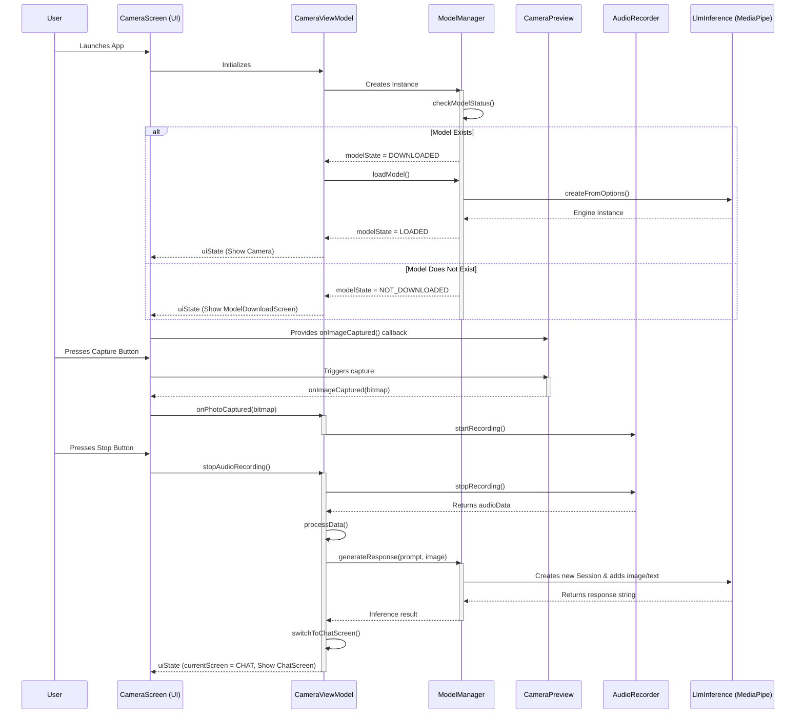
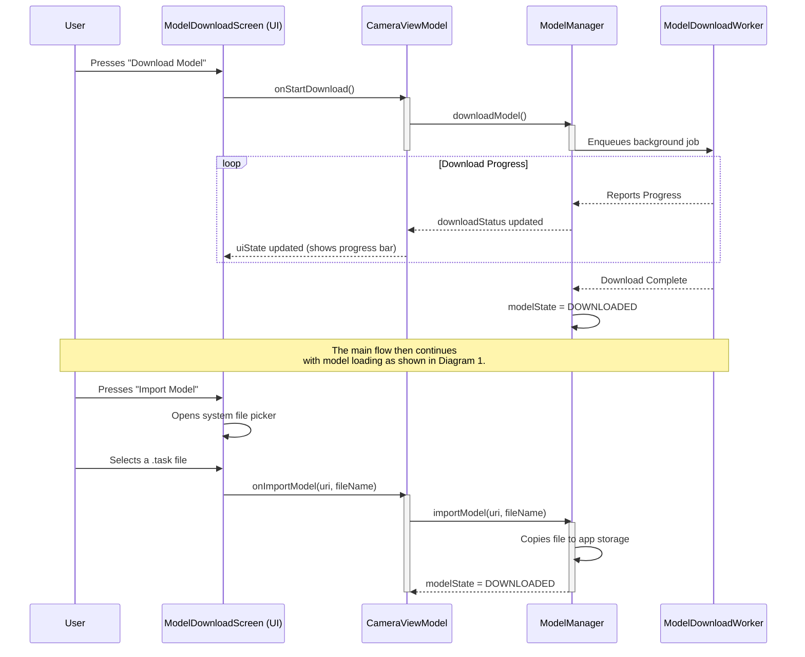

# Project Documentation:  Android App

---

### 1. High-Level Overview

At its core, this application is a simple, camera-first AI agent. Its primary goal is to capture an image and then use a locally-run Large Language Model (LLM) to analyze that image based on a textual prompt.

The app is built using modern Android development practices with Jetpack Compose for the UI and a ViewModel-centric architecture (MVVM) to separate the user interface from the business logic. The AI capabilities are powered by the MediaPipe LLM Inference API, which allows us to run powerful models like Google's Gemma directly on the device.

The user journey is straightforward:
1. The app checks if an AI model is present on the device.
2. If not, it prompts the user to either download a default model or import their own `.task` file from their device's storage.
3. Once a model is available and loaded, the app presents a full-screen camera preview.
4. A single button press captures an image, which then stays on the screen as a background.
5. Immediately after the photo is taken, the app starts recording audio.
6. When the user stops the recording (or after a time limit), the captured image and a hardcoded text prompt ("what is visible?") are sent to the local LLM for analysis.
7. The app transitions to a dedicated chat screen where the model's response is displayed along with the captured image.
8. From the chat screen, users can start a new capture or cancel the current analysis.

---

### 2. Project Structure & Key Modules

The project is organized into several key packages located in `saveme/app/src/main/java/com/app/saveme/`:

-   **`data`**: Contains simple data classes and configuration objects. This is where we define what our data looks like and how the app is configured.
-   **`model`**: The brain of the application. This package is responsible for managing the entire lifecycle of the AI model.
-   **`worker`**: Handles background tasks, specifically downloading the AI model without freezing the UI.
-   **`audio`**: A dedicated class for handling audio recording.
-   **`storage`**: A utility for saving files (images and audio) to the device.
-   **`ui`**: The entire user interface layer, including screens, components, themes, and the ViewModel that drives them.
-   **`utils`**: Helper classes, such as for managing permissions.

---

### 3. Data and Configuration (`data` package)

This package decouples the core logic from hardcoded values.

-   **`ModelConfig.kt`**: This is a crucial configuration file. It defines the default model to be downloaded (`gemma-3n-E2B-it-int4`, which supports vision), its URL, and the current model being used. Most importantly, it contains the `SUPPORTS_VISION` boolean flag. This flag is dynamically set based on the filename of the model being used and is checked by other parts of the app to decide whether to use image-based features.
-   **`Constants.kt`**: This file holds simple, static values used across the app, such as the prompt text (`"what is visible?"`), audio recording settings, and file naming conventions.

---

### 4. AI Model Management (`model` package)

The **`ModelManager.kt`** class is the centerpiece of the app's AI functionality. It handles everything from getting the model onto the device to running inference with it.

-   **Initialization and Status Check**: When `ModelManager` is first created (by the `CameraViewModel`), its `init` block immediately calls `checkModelStatus()`. This function looks inside the app's private storage directory (`getExternalFilesDir/models/`) for any file ending in `.task`. If it finds one, it assumes a model is already present, sets its name in `ModelConfig`, and crucially, **updates the `ModelConfig.SUPPORTS_VISION` flag based on keywords in the filename** (like "gemma-3n", "vision", "E2B"). This ensures that on subsequent app launches, the download/import screen is skipped.

-   **Model Acquisition (Download & Import)**:
    -   **`downloadModel()`**: This function is called when the user chooses to download the default model. It doesn't perform the download itself but instead creates and enqueues a `ModelDownloadWorker` to handle the task in the background. This keeps the UI responsive.
    -   **`importModel()`**: When the user picks a file from their device storage, this function gets a URI to that file. It then copies the file's contents into the app's private `models` directory, giving it a unique name.

-   **Model Loading (`loadModel()`)**: Once a model file is present on the device (either downloaded or imported), this function is called. It performs the critical step of loading the model into memory. It creates an instance of MediaPipe's `LlmInference` engine. During this process, it checks `ModelConfig.SUPPORTS_VISION` and uses it to tell the engine how many images to expect (1 if vision is supported, 0 otherwise).

-   **Inference (`generateResponse()`)**: This is where the magic happens.
    1.  To prevent errors with the MediaPipe library, **it creates a fresh, new `LlmInferenceSession` for every single request.**
    2.  It once again checks `ModelConfig.SUPPORTS_VISION` to configure this new session, enabling or disabling the vision modality.
    3.  It adds the text prompt ("what is visible?") to the session.
    4.  If (and only if) vision is supported and an image (`Bitmap`) was provided, it adds the image to the session.
    5.  Finally, it calls `generateResponseAsync()` to get the result from the model and closes the session to release resources.

---

### 5. The User Interface (`ui` package)

The UI is built entirely with Jetpack Compose and follows a reactive pattern with a two-screen navigation system.

-   **`CameraViewModel.kt`**: This is the central hub connecting the UI to the app's logic. It holds the UI state (`CameraUiState`) in a `StateFlow`, which the UI observes for changes. It owns the instance of `ModelManager` and exposes simple, high-level functions like `startModelDownload()` or `onPhotoCaptured()` that the UI can call without needing to know the implementation details. It also manages navigation between the CAMERA and CHAT screens.

-   **`CameraScreen.kt` (The Main Screen)**: This Composable function is the root of our UI.
    -   It observes the `CameraUiState` from the `CameraViewModel`.
    -   It contains the primary logical branching for the UI:
        1.  If permissions are not granted, it shows a simple message.
        2.  If a model is not ready (`modelState` is NOT_DOWNLOADED, DOWNLOADING, etc.), it displays the **`ModelDownloadScreen.kt`** component.
        3.  For the CAMERA screen, it shows the main camera interface with capture functionality.
        4.  For the CHAT screen, it displays the **`ChatScreen.kt`** component with analysis results.
    -   On the camera screen, it overlays the **`AudioRecordingIndicator.kt`** and the **`CaptureButton.kt`** on top of the **`CameraPreview.kt`**.
    -   When the user captures an image and audio recording starts, it cleverly displays the captured `Bitmap` as a full-screen background, fulfilling the requirement for the image to remain visible.

#### **UI Components (`ui/components` subdirectory)**:

-   **`ModelDownloadScreen.kt`**: This is a self-contained UI for the model acquisition flow. It receives the current `modelState` and `downloadStatus` from the ViewModel and displays the appropriate UI: a download/import button, a progress bar while downloading/importing, or an error message. It uses an `ActivityResultLauncher` to launch the system's file picker for the import functionality.

-   **`ChatScreen.kt`**: A dedicated screen for displaying AI analysis results. It shows the captured image alongside the LLM response in a scrollable interface. Users can start a new capture or cancel the current analysis from this screen.

-   **`CameraPreview.kt`**: Handles the camera preview functionality using CameraX, including image capture capabilities.

-   **`CaptureButton.kt`**: A specialized floating action button that provides visual feedback for capture and recording states. It changes color and icon based on whether audio recording is active.

-   **`AudioRecordingIndicator.kt`**: Displays recording status, duration, and audio amplitude visualization during audio capture.

#### **Theme Structure (`ui/theme` subdirectory)**:

-   **`Theme.kt`**: Defines the app's Material 3 theme configuration
-   **`Color.kt`**: App color palette definitions  
-   **`Type.kt`**: Typography system configuration

---

### 6. Background Worker (`worker` package)

This package offloads long-running tasks from the main application thread, ensuring the UI remains smooth and responsive.

-   **`ModelDownloadWorker.kt`**: This class is a `CoroutineWorker` designed for one specific job: downloading the AI model file from a URL. It's triggered by the `ModelManager` when a download is required. It handles the network connection, reads the data in chunks, and saves the file to the app's private storage. Crucially, it reports progress back to the `ModelManager`, allowing the UI to display a real-time progress bar to the user. Using a `Worker` is best practice for tasks like this that need to continue even if the user navigates away from the app.

---

### 7. Audio Handling (`audio` package)

This package contains the logic for recording audio from the device's microphone.

-   **`AudioRecorder.kt`**: A self-contained class responsible for the raw audio recording process. It uses Android's `AudioRecord` API to get direct access to the audio stream from the microphone. When recording starts, it continuously reads audio data into a buffer. It also provides callbacks to the `CameraViewModel` to update the UI with the live recording duration and the current audio amplitude (for the visualizer). When the recording stops, it returns the complete audio data as a `ByteArray`.

---

### 8. File Storage (`storage` package)

This package provides simple, reusable utilities for handling file operations.

-   **`FileManager.kt`**: This class abstracts the details of saving files to the device. It has two main functions:
    -   `saveImage()`: Takes a `Bitmap` object (the captured photo) and saves it as a `.jpg` file in the app's private external storage.
    -   `saveAudioData()`: Takes the `ByteArray` from the `AudioRecorder` and saves it as a `.pcm` file.
    It also includes a `cleanupOldFiles()` method to prevent the app's storage from growing indefinitely by keeping only the most recent captures.

---

### 9. Utilities (`utils` package)

This package holds miscellaneous helper classes that can be used across the application.

-   **`PermissionUtils.kt`**: A simple but important utility for handling Android's runtime permissions. It defines the list of permissions the app requires (`CAMERA` and `RECORD_AUDIO`) and provides a helper function, `hasAllPermissions()`, that the `CameraScreen` calls on startup to check if it's safe to proceed with using the camera and microphone. This centralizes permission logic, making it easy to manage.

---

### 10. Navigation and User Flow

The app uses a simple two-screen navigation system managed by the `AppScreen` enum:

1. **CAMERA Screen**: The primary interface with camera preview, capture button, and audio recording functionality
2. **CHAT Screen**: Displays analysis results with the captured image and LLM response

The navigation flow is:
- **App Launch** → **Model Check** → **Camera Screen** (if model ready) or **Model Download Screen**
- **Image Capture** → **Audio Recording** → **AI Analysis** → **Chat Screen**
- **Chat Screen** → **New Capture** (returns to Camera Screen) or **Cancel** (returns to Camera Screen)

---

### 11. Architecture Flow Diagrams

While a class diagram is good for showing the static structure of the app, **Sequence Diagrams** excel at visualizing how different objects and classes interact with each other over time. They clearly show the flow of function calls and events throughout the application lifecycle.

Below are two sequence diagrams that illustrate the architecture and the main operational flows of the application.

---

#### **Diagram 1: Main Application & Inference Flow**

This diagram shows the sequence of events from the moment the user starts the app to when an AI analysis is performed on a captured image and displayed in the chat screen.

#### **Explanation of the Main Flow:**

1.  **Initialization**: When the app starts, the `CameraScreen` UI is created. This, in turn, initializes the `CameraViewModel`. The ViewModel immediately creates an instance of the `ModelManager`.
2.  **Model Check**: The first thing the `ModelManager` does is `checkModelStatus()`. It looks in the app's private storage for a `.task` model file.
    *   **If a model exists**, the `ModelManager` updates its state. The `CameraViewModel` observes this change and calls `loadModel()`, which prepares the MediaPipe `LlmInference` engine. The UI then proceeds to show the `CameraPreview`.
    *   **If no model exists**, the state is set to `NOT_DOWNLOADED`, and the UI shows the `ModelDownloadScreen` instead of the camera.
3.  **Capture**: The user presses the capture button. The `CameraPreview` handles the actual image capture and sends the resulting `Bitmap` back to the `CameraScreen`, which passes it to the `CameraViewModel`.
4.  **Recording**: The `CameraViewModel` receives the image, saves it, and immediately calls `startRecording()` on the `AudioRecorder` instance.
5.  **Inference**: When the user presses the stop button, the `CameraViewModel` stops the audio recording and calls `processData()`. This function is the trigger for the AI analysis. It calls the `generateResponse()` method in the `ModelManager`, passing in the captured image and the hardcoded prompt.
6.  **AI Analysis**: The `ModelManager` creates a new, temporary inference *session*, adds the image and text, and gets a response back from the MediaPipe engine.
7.  **Navigation to Chat**: The response string is passed back to the `CameraViewModel`, which calls `switchToChatScreen()` to update the navigation state. The `CameraScreen` observes this change and displays the `ChatScreen` with the analysis results.

---

#### **Diagram 2: Model Acquisition Flow (Download & Import)**

This diagram details what happens when the user needs to get a model onto the device. This flow is managed by the `ModelDownloadScreen`.

#### **Explanation of the Acquisition Flow:**

1.  **Download**:
    -   When the user taps "Download", the UI calls a function in the `CameraViewModel`.
    -   The ViewModel delegates this to the `ModelManager`, which enqueues a `ModelDownloadWorker`. This worker runs in the background, ensuring the UI doesn't freeze during the large download.
    -   The `ModelManager` continuously observes the worker's progress and updates a `downloadStatus` state. The UI, in turn, observes this state and updates the progress bars.
    -   Once the download is finished, the `ModelManager` sets the `modelState` to `DOWNLOADED`, and the main flow takes over to load the model.

2.  **Import**:
    -   When the user taps "Import", the `ModelDownloadScreen` uses a standard Android feature (`ActivityResultLauncher`) to open the system file picker.
    -   After the user selects a file, the UI receives its `Uri` and passes it to the `CameraViewModel`.
    -   The ViewModel tells the `ModelManager` to `importModel()`. The `ModelManager` then reads the data from the selected file and copies it into the app's own private storage directory.
    -   Once copied, the `modelState` is set to `DOWNLOADED`, and the main flow continues.

---

### 12. Key Technical Decisions

Several important architectural decisions were made to ensure the app works reliably:

-   **Fresh Sessions for Each Request**: The MediaPipe LLM library can have timestamp conflicts when reusing sessions. To avoid this, the app creates a completely new `LlmInferenceSession` for every inference request and closes it immediately afterward.

-   **Vision Support Detection**: Not all LLM models support image input. The app automatically detects whether a model supports vision by examining keywords in the filename (like "gemma-3n", "E2B", "vision"). This prevents runtime errors when trying to add images to non-vision models.

-   **Background Downloads**: Large model files (3GB+) are downloaded using Android's `WorkManager` to ensure the download continues even if the user switches apps or the screen turns off.

-   **Private Storage**: All model files and captured data are stored in the app's private external storage directory, ensuring they don't clutter the user's device and are automatically cleaned up when the app is uninstalled.

-   **Reactive UI**: The entire UI is built with Jetpack Compose and follows a reactive pattern where the UI automatically updates when the underlying state changes, eliminating the need for manual UI updates.

-   **Two-Screen Navigation**: The app uses a dedicated chat screen to display results rather than overlaying them on the camera screen, providing a cleaner user experience and better content organization.

---

### 12. Dependencies and Requirements

The app requires:
-   **Android API Level 31+** (Android 12+)
-   **Target SDK 36** (Android 14+)
-   **Camera and Microphone permissions**
-   **Internet permission** (for model downloads only)
-   **At least 4GB of available storage** (for the AI model)

Key dependencies:
-   **Jetpack Compose** for the UI
-   **CameraX** for camera functionality
-   **MediaPipe LLM Inference API** for on-device AI
-   **WorkManager** for background tasks
-   **Material 3** for UI components
-   **Material Icons Extended** for additional icons
-   **Gson** for JSON parsing
