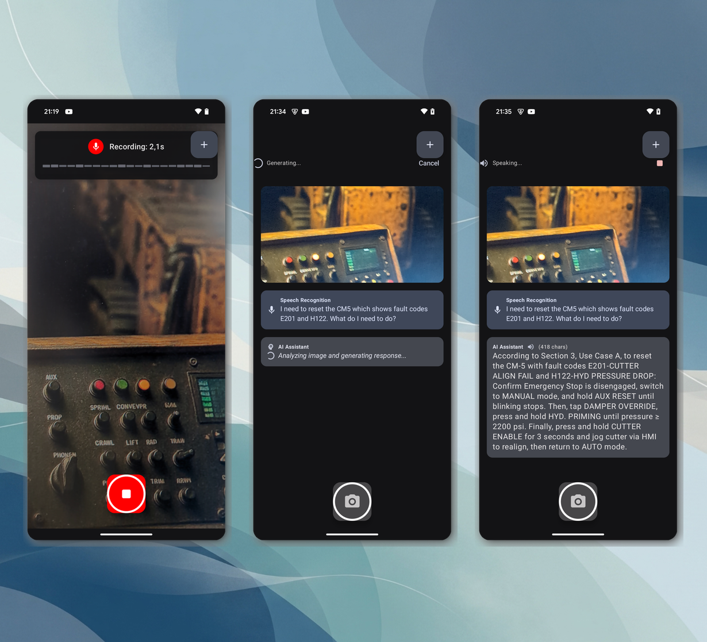

# SaveMe - the digital twin rescue app ✨

## 🚀 Quick Start

### Setup Process

To get started with SaveMe, follow these simple steps:

1. **Download & Install**: Get the app from [save-me.app](https://save-me.app/)
2. **Enter Demo Token**: Use the token "demo" to test with our pre-configured context
3. **Model Loading**: The app automatically downloads and loads the Gemma3n model with expert context
4. **Optional Context Switch**: Tap the button in the top-right corner to load a different context

> **Note**: The initial setup requires an internet connection. For custom contexts and tokens, see [section 2.2](#22-website).

<div style="text-align: center;">
  
</div>

### Usage Workflow

Once setup is complete, SaveMe works entirely offline with your loaded expert context:

1. **Capture & Record**: Press the capture button to take a photo and automatically start audio recording (max 10 seconds)
2. **AI Processing**: The app processes your input through multiple AI models:
   - **Whisper**: Transcribes your audio message to text
   - **Gemma 3n**: Analyzes the image, transcribed text, and context together
3. **Real-time Response**: The AI response is streamed token-by-token and spoken aloud using Android's Text-to-Speech engine

<div style="text-align: center;">
  
</div>


# Architectural details

The SaveMe solution consists of an Android application for in-field use and a companion website for knowledge management. Go to [save-me.app](https://save-me.app/) to upload your context, generate a token and download the android app.

### 2.1. Android Application

The SaveMe application is built as a native Android application using Kotlin and Jetpack Compose. The architecture is designed to be modular and scalable, with a clear separation of concerns between the UI, the application logic, and the AI models.

The application is composed of the following key components:

*   **UI Layer (`MainActivity.kt`, `CameraScreen.kt`, `CameraViewModel.kt`):** This layer is responsible for rendering the user interface and handling user input. It's built with Jetpack Compose, which allows for a declarative and modern UI. The `CameraViewModel` acts as a bridge between the UI and the underlying application logic.
*   **Application Logic (`CameraViewModel.kt`):** This is the heart of the application, orchestrating the interaction between the UI, the AI models, and the various services. It manages the application's state and handles the entire workflow, from capturing images and audio to processing them with the AI models and presenting the results to the user.
*   **AI Model Management (`ModelManager.kt`):** This component is responsible for managing the Gemma 3n model. It handles the downloading, validation, loading, and execution of the model. It uses the MediaPipe GenAI library to interact with the model and provides a clean, high-level API for the rest of the application.
*   **Speech-to-Text (`TranscriptionService.kt`):** This service is responsible for converting the user's speech into text. It uses a local Whisper model for on-device transcription, ensuring privacy and offline availability.
*   **Text-to-Speech (`TTSManager.kt`):** This service converts the AI's text response into speech. It uses Android's built-in TTS engine and implements a custom streaming solution to provide a real-time, natural-sounding voice.
*   **Supporting Components:** The application also includes several supporting components, such as `AudioRecorder` for handling audio input, `FileManager` for local data storage, and `AudioConverter` for audio format conversion.

The following diagram illustrates the high-level architecture of the application:

```
[User] -> [UI Layer (Jetpack Compose)] <-> [CameraViewModel] <-> [ModelManager (Gemma 3n)]
                                             ^
                                             |
                                             v
                               [TranscriptionService (Whisper)]
                                             ^
                                             |
                                             v
                                     [TTSManager (Android TTS)]
```

This architecture ensures that each component has a single responsibility, making the application easier to understand, maintain, and extend. The use of on-device AI models for both speech-to-text and the core LLM ensures that the application is fast, responsive, and can function without a persistent internet connection.

### 2.2. Website

A companion website allows companies to manage the knowledge bases for their "Digital Twins." This is where user manuals, safety regulations, and other critical documents are processed and made available for download by the Android application.

---
<div style="text-align: center;">
  
</div>

---


## 3. Gemma 3n Implementation

The core of the SaveMe application is its use of the Gemma 3n model to provide intelligent, context-aware assistance. The implementation is handled by the `ModelManager` class, which encapsulates all the logic for interacting with the model. More specifically the gemma-3n-E2B-it-int4 model in .task format.

### 3.1. Model Loading and Configuration

The application uses the MediaPipe GenAI library to load and run the Gemma 3n model. The `loadModel` function in `ModelManager.kt` is responsible for this process. Here's a simplified version of the code:

```kotlin
// In ModelManager.kt

fun loadModel(): Boolean {
    // ...
    val options = LlmInference.LlmInferenceOptions.builder()
        .setModelPath(modelFile.absolutePath)
        .setMaxTokens(4096)
        .setMaxTopK(40)
        .setMaxNumImages(if (ModelConfig.SUPPORTS_VISION) 1 else 0)
        .build()

    val llmInference = LlmInference.createFromOptions(context, options)

    val session = LlmInferenceSession.createFromOptions(
        llmInference,
        LlmInferenceSession.LlmInferenceSessionOptions.builder()
            .setTopK(10)
            .setTopP(0.3f)
            .setTemperature(0.2f)
            .setGraphOptions(
                GraphOptions.builder()
                    .setEnableVisionModality(ModelConfig.SUPPORTS_VISION)
                    .build()
            )
            .build()
    )
    // ...
}
```

This code snippet demonstrates several key aspects of the implementation:

*   **Dynamic Vision Support:** The application dynamically enables vision support based on the loaded model. The `ModelConfig.SUPPORTS_VISION` flag, which is set by inspecting the model's filename, allows the app to seamlessly switch between vision-enabled and text-only models. The current setup of the app works only with multimodal models with vision support. 
*   **Model Configuration:** The `LlmInferenceOptions` are used to configure the model, setting parameters like the maximum number of tokens and the number of images that can be processed.
*   **Session Configuration:** The `LlmInferenceSessionOptions` are used to control the model's output. The `topK`, `topP`, and `temperature` parameters are tuned to produce more deterministic and coherent responses.

### 3.2. Multimodal Input and Streaming Response

The `generateResponseStreaming` function is where the magic happens. It takes a text prompt and an image, and it returns a streaming response from the model. Here's a simplified overview of the process:

```kotlin
// In ModelManager.kt

fun generateResponseStreaming(
    prompt: String,
    imageBitmap: Bitmap? = null,
    onTokenReceived: (token: String, isComplete: Boolean) -> Unit
) {
    // 1. Reset the session to clear previous context
    resetSession()

    // 2. Add the "Digital Twin" context to the prompt
    val fullPrompt = getFullPromptWithContext(prompt)

    // 3. Add the image to the session if vision is supported
    if (ModelConfig.SUPPORTS_VISION && imageBitmap != null) {
        session.addImage(BitmapImageBuilder(imageBitmap).build())
    }

    // 4. Add the prompt to the session
    session.addQueryChunk(fullPrompt)

    // 5. Generate a streaming response
    session.generateResponseAsync { partialResult, done ->
        onTokenReceived(partialResult, done)
    }
}
```

This implementation highlights several advanced features:

*   **Session Management:** The `resetSession()` call is crucial for ensuring that each interaction with the model is independent and not influenced by previous queries. This prevents context bleed and ensures predictable behavior.
*   **Digital Twin Context:** The application supports a "Digital Twin" feature, which allows users to load a personalized context from a remote server. This context is prepended to the prompt, enabling the model to provide more relevant and personalized responses.
*   **Streaming:** The use of `generateResponseAsync` allows the application to receive the model's response token by token. This is essential for providing a real-time user experience, as the application can start displaying and speaking the response as it's being generated, rather than waiting for the entire response to be available.
*   **Multimodality:** The ability to seamlessly handle both text and image input makes the application truly multimodal. The model can understand and reason about the visual information from the image in conjunction with the user's spoken query, enabling a wide range of powerful use cases.

## 4. Challenges and Solutions

Developing a real-time, on-device multimodal AI application presented several technical challenges. This section outlines the most significant challenges and the solutions we implemented to overcome them.

### 4.1. Intuitive Multimodal Recording

**Challenge:** The use case requires very high usability. The user must be able to capture both visual and auditory information quickly and easily, often in challenging environments. A complex interface would be a significant barrier to adoption. The ideal of processing a live video and audio stream is not yet feasible for on-device models of this size.

**Solution:** This challenge was overcome by designing a simple, one-button interface. When the user presses the capture button, the application first takes a high-resolution photo and then immediately begins recording a voice message. This two-step process, triggered by a single action, provides a seamless experience for capturing the necessary multimodal data without overwhelming the user.

### 4.2. Real-time, Low-Latency Streaming

**Challenge:** One of the biggest challenges was achieving real-time, low-latency streaming of the AI's response. A slow or delayed response would result in a poor user experience.

**Solution:** We addressed this challenge by implementing a multi-faceted streaming solution:

1.  **Streaming from the Model:** We use the `generateResponseAsync` function from the MediaPipe GenAI library to receive the model's response token by token.
2.  **Streaming to the UI:** The `CameraViewModel` receives the tokens and immediately updates the UI, allowing the user to see the response as it's being generated.
3.  **Streaming to the TTS Engine:** The `TTSManager` implements a custom buffering and streaming mechanism. It accumulates the tokens and speaks the response sentence by sentence, creating a natural and continuous flow of speech.

This end-to-end streaming pipeline ensures that the user starts receiving feedback from the application almost instantly, creating a highly responsive and engaging user experience.

### 4.3. Robust Model Management

**Challenge:** The application relies on a large AI model that needs to be downloaded and stored on the user's device. This process is prone to errors, such as network interruptions, corrupted files, and insufficient storage.

**Solution:** We implemented a robust `ModelManager` to handle these challenges:

*   **Reliable Downloads:** We use Android's `WorkManager` to handle the model download. `WorkManager` ensures that the download continues even if the app is closed or the device is restarted.
*   **File Validation:** Before loading the model, the `ModelManager` performs a series of validation checks, including verifying the file size and readability. This prevents the app from crashing due to a corrupt or incomplete model file.
*   **User-Friendly Error Handling:** The UI clearly communicates the state of the model to the user, with different screens for downloading, and initializing the model. In case of an error, the user is provided with clear feedback and the option to retry the download.

### 4.4. On-Device Speech-to-Text

**Challenge:** To ensure privacy and offline availability, we needed an on-device speech-to-text solution. Cloud-based solutions would introduce latency and require a network connection.

**Solution:** We integrated a local Whisper model into the application. The `TranscriptionService` uses a tiny English Whisper model (`whisper-tiny.en.tflite`) to perform fast and accurate transcription directly on the user's device. This approach has several advantages:

*   **Privacy:** The user's voice data never leaves their device.
*   **Offline Functionality:** The app can transcribe speech without an internet connection.
*   **Low Latency:** On-device transcription is significantly faster than cloud-based solutions.

### 4.5. Seamless Multimodality

**Challenge:** The application needed to seamlessly handle both visual and auditory input, and the AI model needed to be able to reason about both modalities simultaneously.

**Solution:** The multi-modal implementation of the app closely followed the great project "Google AI Edge Gallery," which already provided a strong example for combined image-text input. The MediaPipe GenAI library provides the core built-in support for multimodal input, which our `ModelManager` leverages by:

*   **Dynamically Enabling Vision:** The app detects whether the loaded model supports vision and configures the `LlmInference` engine accordingly. The support of non vision models would mean, that the input is text-only. That is currently not implemented in our mvp's ui. Our main screen is the camera screen that requires a multimodal model with vision support. If the customer requires much faster responses even without image input, this feature could be implemented.

*   **Combining Inputs:** The `generateResponseStreaming` function takes both a text prompt and an image, and it passes them to the model for processing.

This seamless integration of multimodality is what makes the SaveMe application so powerful and versatile.

## 5. Technical Choices

The development of the SaveMe application involved a series of deliberate technical choices designed to create a high-quality, robust, and user-friendly application. This section explains the rationale behind our key decisions.

### 5.1. On-Device AI

The most significant technical decision was to run all the AI models on the user's device. This includes the Gemma 3n LLM and the Whisper speech-to-text model. We chose this approach for several reasons:

*   **Privacy:** On-device processing ensures that the user's personal data, including their voice and images, never leaves their device. This is a critical feature for an application that has access to sensitive information.
*   **Performance:** On-device AI eliminates the network latency associated with cloud-based solutions, resulting in a much faster and more responsive user experience.
*   **Offline Functionality:** The application can function without an internet connection, making it more reliable and accessible in a wider range of scenarios.
*   **Cost:** On-device processing eliminates the need for expensive cloud-based AI services, making the application more scalable and sustainable in the long run.

### 5.2. MediaPipe GenAI

We chose to use the MediaPipe GenAI library for running the Gemma 3n model. This was a strategic decision based on the following factors:

*   **Performance:** MediaPipe is highly optimized for on-device inference, delivering the best possible performance on a wide range of Android devices.
*   **Ease of Use:** The library provides a high-level, easy-to-use API that abstracts away the complexities of on-device machine learning. This allowed us to focus on the core application logic rather than the low-level details of model execution.
*   **Multimodality:** MediaPipe provides built-in support for multimodal input, which was a key requirement for the SaveMe application.
*   **Streaming Support:** The library's support for streaming responses was essential for achieving the real-time user experience we were aiming for.

### 5.3. Jetpack Compose

We chose Jetpack Compose for building the user interface. This modern UI toolkit for Android development offered several advantages:

*   **Declarative UI:** Compose's declarative approach makes it easier to build and maintain complex UIs.
*   **Kotlin-based:** Compose is written in Kotlin, which is the recommended language for Android development. This allowed us to use a single language throughout the application.
*   **Fast Development:** Compose's live preview and interactive development tools helped us to iterate quickly and build the UI in less time.

### 5.4. Whisper and Android TTS

For the audio components, we made two key choices:

*   **Whisper for Speech-to-Text:** We chose to use a local Whisper model. While Android provides a built-in speech recognition service, we found that Whisper offered superior accuracy, particularly in potentially noisy field environments. Its on-device nature was also a perfect fit for our privacy and offline-first requirements.
*   **Android's Native TTS for Text-to-Speech:** For voice output, we used Android's built-in Text-to-Speech engine. It is highly efficient, available on all devices without extra dependencies, and our `TTSManager`'s custom streaming layer made it perfectly suitable for handling real-time, token-by-token output from the Gemma model.

These technical choices were instrumental in the successful development of the SaveMe application. By prioritizing on-device AI, performance, and user experience, we were able to create a powerful and innovative application that showcases the potential of multimodal AI on mobile devices. 

---


The app requires:
-   **Android API Level 31+** (Android 12+)
-   **Target SDK 36** (Android 14+)
-   **Camera and Microphone permissions**
-   **Internet permission** (for model downloads only)
-   **At least 4GB of available storage** (for the AI model)

Key dependencies:
-   **Jetpack Compose** for the UI
-   **CameraX** for camera functionality
-   **MediaPipe LLM Inference API** for on-device AI
-   **WorkManager** for background tasks
-   **Material 3** for UI components
-   **Material Icons Extended** for additional icons
-   **Gson** for JSON parsing
